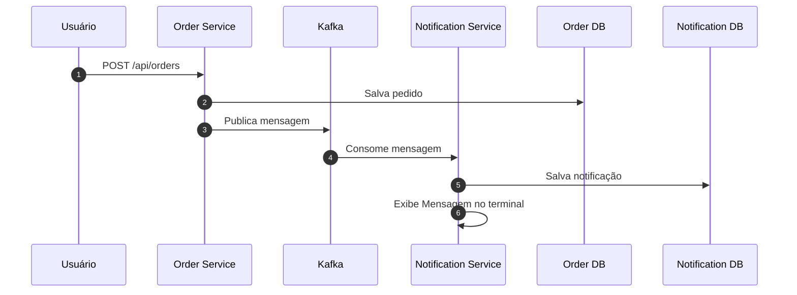

# Sistema de Notificação de Pedidos com Kafka e Microsserviços utilizando Spring Boot

Sistema onde ocorre comunicação assíncrona entre microsserviços usando o Kafka.


## Tecnologias

- **Spring Boot**
- **Apache Kafka**
- **H2 Database**
- **Java 21**
- **Maven**
- **Docker**

## Diagrama de Comunicação


## Como executar

### 1 - Clone o repositório:

```bash
git clone https://github.com/patrickmartx/Order-Notification-Message-System.git
 ```

### 2 - Inicie o Kafka:

```bash
cd Order-Notification-Message-System
docker-compose up -d
```

### 3 - Execute os serviços em dois terminais diferentes

#### Terminal 1:
```bash
cd order-service && mvn spring-boot:run
```

#### Terminal 2:
```bash
cd notification-service && mvn spring-boot:run
```

## Exemplo de requisição para teste

```bash
curl --location 'localhost:8081/api/v1/orders' \
--data '{
    "productName":"Chocolate",
    "quantity":2
}'
```

## Recursos adicionais:

**Database**
- **Console do banco de dados H2 de Pedidos**: [http://localhost:8081/h2-console](http://localhost:8081/h2-console)  
  JDBC URL: `jdbc:h2:mem:orderdb`
- **Console do banco de dados H2 de Notificações**: [http://localhost:8082/h2-console](http://localhost:8082/h2-console)  
  JDBC URL: `jdbc:h2:mem:notificationdb`

**Kafka Ui**
- **Interface do kafka**: [http://localhost:8080/](http://localhost:8080/)

